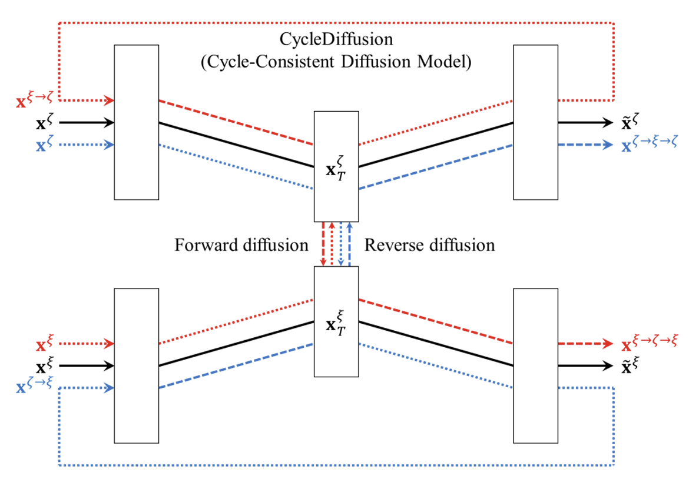

# CycleDiffusion

**CycleDiffusion** is a novel voice conversion (VC) framework that leverages *cycle-consistent diffusion models* to enhance the quality and consistency of converted speech. By learning both reconstruction and conversion paths using diffusion architectures, our model achieves superior performance for non-parallel, many-to-many voice conversion tasks.

---

## 📝 Overview

> **CycleDiffusion: Voice Conversion Using Cycle-Consistent Diffusion Models**  
> Dongsuk Yook, Geonhee Han, Hyung-Pil Chang, and In-Chul Yoo  
> [*Applied Sciences, 2024*](https://doi.org/10.3390/app14209595)

### Main Contributions:
- Proposing a novel **Cycle-Consistent Diffusion Model** for voice conversion.
- Introducing **Cycle Consistency Loss** to enhance semantic preservation across conversions.

---

## 🧠 Architecture

<p align="center">
  
</p>

The diagram above illustrates the overall architecture of CycleDiffusion. It consists of two diffusion models operating in a cycle: one for converting input voice features to the target domain, and another for reconstructing the original voice through reverse diffusion, enabling strong cycle consistency.

---

## 🚩 Highlights

- **Cycle-Consistent Diffusion Architecture**  
  Two diffusion models jointly trained for reconstruction and voice conversion.
  
- **Cycle Consistency Loss**  
  Ensures preservation of linguistic content through cyclic conversions.

- **Non-parallel Training**  
  Eliminates the need for paired training samples.

- **Comprehensive Evaluations**  
  Speaker similarity, ASR-based linguistic preservation, Mel-Cepstral Distance (MCD), and subjective Mean Opinion Score (MOS).

---

## 📖 Citation

If you find this project helpful, please cite our paper:

```bibtex
@Article{app14209595,
AUTHOR = {Yook, Dongsuk and Han, Geonhee and Chang, Hyung-Pil and Yoo, In-Chul},
TITLE = {CycleDiffusion: Voice Conversion Using Cycle-Consistent Diffusion Models},
JOURNAL = {Applied Sciences},
VOLUME = {14},
YEAR = {2024},
NUMBER = {20},
ARTICLE-NUMBER = {9595},
URL = {https://www.mdpi.com/2076-3417/14/20/9595},
ISSN = {2076-3417},
DOI = {10.3390/app14209595}
}
